# DO1_Linux

## Part 1
  

- *screenshot with currently installed Ubuntu server version*

## Part 2  

  

- *adding user with `useradd` command*  

   

- *new user (student) in output of `cat /etc/passwd` 
(the last one)*

## Part 3

- to set the machine name as user-1 we'll go to `/etc/hostname` and rewrite it using `sudo` and our text editor **vim** 
- to set the time zone we will create a symlink from `/usr/share/zoneinfo/` to
`/etc/localtime/` using this command `sudo ln -sf /usr/share/zoneinfo/Asia/Yekaterinburg /etc/localtime/`
checking with `timedatectl`  

- outputing names of the network interfaces using `ip link` command, which shows 2 interfaces  

1. lo
 > **lo** (loopback) network interface is used by device to send data to itself for testing and local communication  
2. actual  router interface connected through Ethernet cable *(enp03s)*, which has *ipv6* address
- getting ip address from DHCP server using `sudo dhclient -v` with `-v`(verbose) flag to get more information. DHCP (Dynamic Host Configuration Protocol) is a network manager protocol which automatically assigns ip addresses to devices on a network. It's also responsible for masking our ip address  

- we can use `ip a` in a console to see all the ip addresses on all network interfaces and redirect its input into **grep** comand fot it to show all the internal ip adresses.  

  

- to get external ip address of the gateway, which is the address of my router i'm curling the ifconfig with `curl ifconfig.me` command. also I'm adding an empty line to separate it from my hostname and username)  

  

- setting static ip address and dns settings through changing the config in `/etc/netplan/"my network config.yaml"`.  

  

 - using vim i'm setting my static gateway ip to `192.168.1.175/24`(/24 for masking first 3 numbers and leaving the last one for everyone else to see) and dns servers to `1.1.1.1` and `8.8.8.8`  
   
 next, using `ip route show` command we can assure that we have changed our ip address to this in config file  
 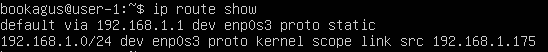  
 - pinging 1.1.1.1 and ya.ru to see if we are connected to network and do we have any packet loss (spoiler: we don't)  
   
   

## Part 4  
- Прописав в терминале комманды `sudo apt update` и `sudo apt upgrade` мы можем обновить системные пакеты до последней версии
- Прилагаю скриншот терминала, который говорит нам о том, что система обновлена и дальше обновлять нечего  

## Part 5

- Назначение команды `sudo` заключается в том, чтобы юзер мог выполнять определенные команды от лица суперюзера (или рута) или от лица любого друга юзера, если это необходимо. Устанавливать пакеты, добавлять/менять/удалять файлы в системных директориях, сидя не на рут аккаунте, можно в том числе c помощью sudo  

- Меняем название самой машины, открывая конфигурацию с правами суперюзера `sudo vim /etc/hostname`на `ubuntu server`    

## Part 6

- Вывод системной службы `timedatectl` и настроек этой службы `timedatectl show` показывают правильное время/часовой пояс и синхронизируют его через интернет `Ntpsynchronized=yes`  

## Part 7

- Я выбрал редакторы Vim, Nano и Ne. создал для каждого txt файл командами `<текстовый редактор> <текстовый редактор.txt>`и вписал в каждый файл свой ник
1. vim  
  
чтобы выйти из vim с сохранением файла нужно сначала выйти в режим ввода комманд с помощью `Escape`и дальше ввести команду `:wq`. Вот так вот просто!) 
2. nano  
 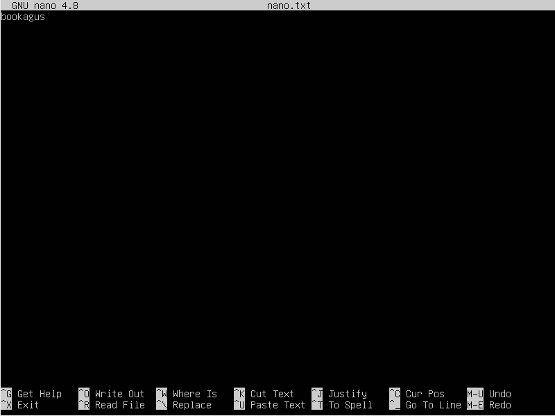  
чтобы выйти из нано достаточно нажать `CTRL + S` чтобы перезаписать файл и `CTRL + X`. Готово!  
3. ne  
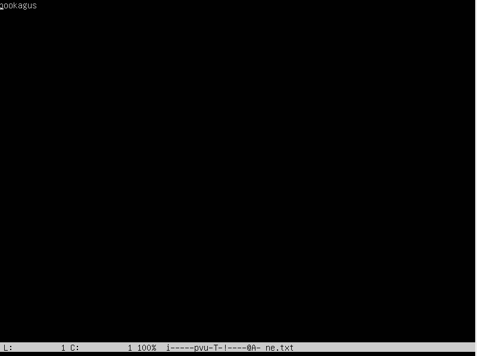  
 чтобы выйти из Ne и сохранить файл жамкаем на клавиатуре `ALT + X`
 
- далее меняем во всех трех файлах содержимое на *21 School 21* и выходим без сохранения изменений    
4. vim  
  
чтобы выйти без сохранения `Escape` и вводим `:q!` чтобы выйти без записи в файл  
5. nano  
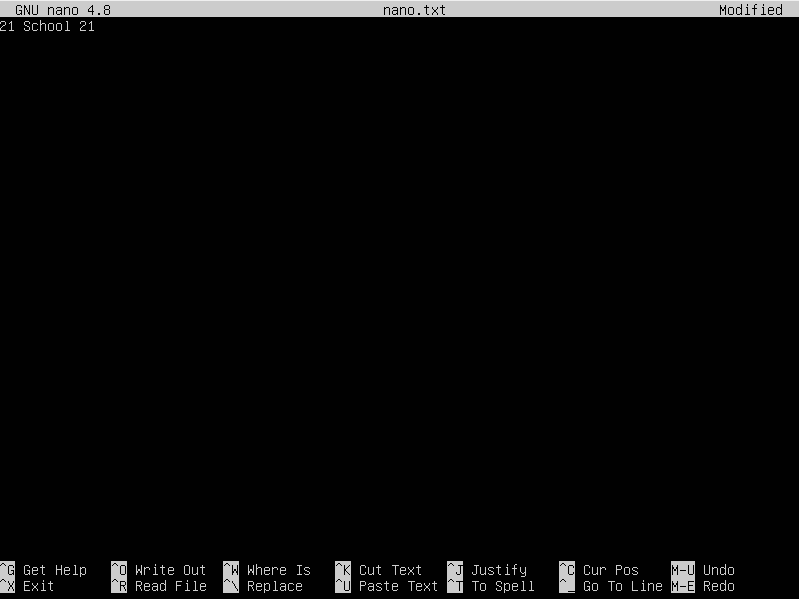  
выходим через `CTRL + X`и далее отказываемся от записи в буфер нажимая клавишу `n`  
6. ne  
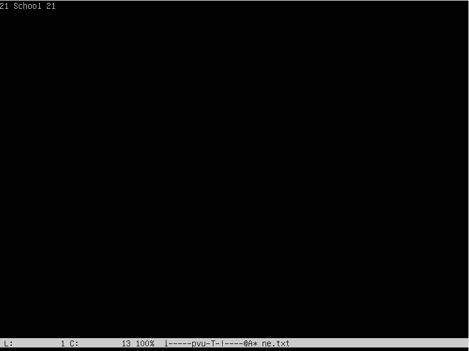  
тут достаточно будет нажать комбинацию `ALT + Q`  

- в этот раз в каждом файле нужно найти и заменить слово на любое другое. Я выбрал заменить свой никнейм bookagus на слово babaganush. Итак  
7. vim  
  
чтобы найти и поменять слово в vim нам нужно выйти в режим ввода команд и ввести команду `:s/bookagus/babaganush`она найдет и заменит первое попавшееся в строке слово bookagus на babaganush. У команды `:s` есть много настроек и флагов. Например, с помощью знака `%` мы можем запросить замену одного слова на другое во всем  файле  
8. nano  
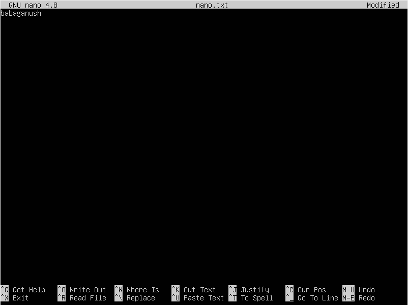  
в nano нам нужно нажать `CTRL + \`. редактор попросит нас ввести слово которое нужно заменить и на какое слово нужно его заменить. после этого можно пройтись по каждому совпадению в файле и решить, хотим мы его заменить или нет (или заменить сразу все совпадения в файле)  
9. ne   
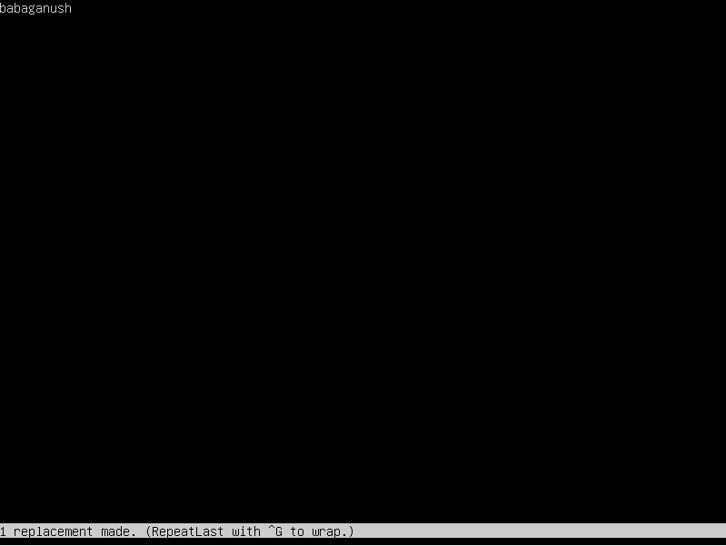  
в ne нужно ввести на клавиатуре сочетание `CTRL + R`а дальше все как в нано, устал писать)  

## Part 8  

- устанавливаю sshd через команду `sudo apt install openssh-client openssh-server`.  
- первым делом запускаю службу ssh через системную ютилиту systemctl командой `sudo systemctl start ssh`. чтобы служба запускалась автоматически при загрузке системы нужно разрешить ей это через команду `sudo systemctl enable ssh`. 
- перенастраиваю порт службы на порт 2022 редактируя конфиг. открываю конфиг `sudo vim /etc/ssh/sshd_config` и в 15-строчке убираю #, чтобы раскомментировать строку и там же меняю порт с 22 на 2022  
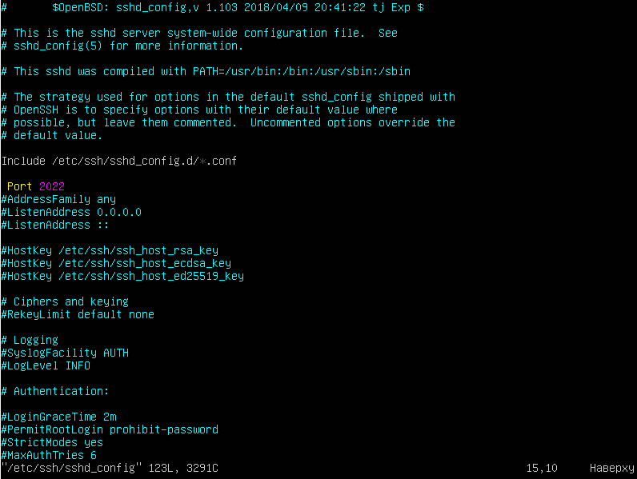  
- далее проверям через команду `ps` наличие процесса sshd после перезапуска системы. для этого используем ключи:  
1. `-f`. с помощью него мы сможем увидеть более подробную информацию о процессе. его персональный айди, родительский процесс, время начала работы процесса.  
2. `-C` нужен для поиска процессов по ключевым словам.  

как итог, введя команду `ps -f -C sshd` мы точно удостоверимся в том, что наш процесс работает после перезапуска системы :)   
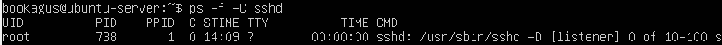  

- команда `netstat` позволяет нам посмотреть статистику наших сетевых подключений, информацию о занятых портах, а также диагностировать проблемы в подключении в сети.  
добавляя к этой команды ключи, мы можем конкретизировать параметры поиска по характеристикам сети, которые нас интересуют.  
например, ключ `-t`  позволяет нас отсортировать подключения, которые используют TCP порты, такие как ssh/http/ftp, чтобы увидеть через какие порты трафик поступает на наш компьютер. ключ `-n` заменяет буквенные наименования ip адресов на численные, это ускоряет вывод команды. и последний флаг который мы будем использовать это `-a`что является сокращением от all. дальнейшие объяснения излишни)  
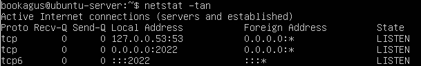   
слева-направо по столбцам:  
1. proto - протокол подключения. обычно tcp/tcp6 или udp/udp6
2. recv-q и send-q это по сути недошедшие байты либо от нас, либо к нам. когда значение этих столбцов 0, значит, что все хорошо и беспокоится не о чем
3. local address - это сетевой адрес нашего компьютера, где запущен процесс
4. foreign address же указывает сетевой адрес удаленной машины, к которой подключен наш хост, и это все для конкретного процесса (sshd в нашем случае)
5. state означает статут указанного порта. listening если порт открыт и ждет, когда к нему произойдет подключение. established если подлючение к порту активно и через него уже можно посылать/получать какие-то данные и.т.д
6. а айпи 0.0.0.0 значит, что мы можем напрямую подключиться к машине

## Part 9  

- top:  
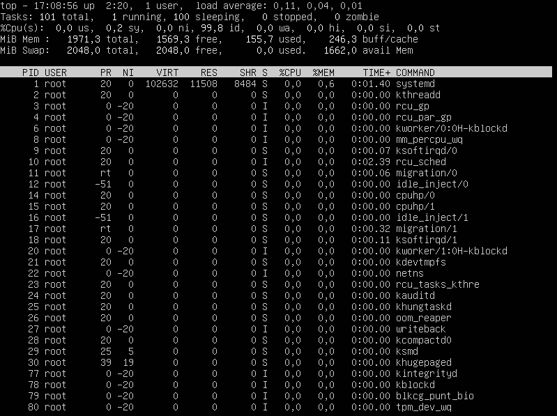  
теперь показатели:
1. uptime - **2:20**
2. кол-во авторизированных пользователей - **1**
3. средняя загрузка системы - это нагрузка процессора за последнюю минуту **(0.11)**, 5 минут **(0.04)** и 15 минут **(0.01)**. это значение в процентах, на сколько загружены наши процессоры. 
4. общее кол-во процессов - **101**
5. загрузка cpu (все в процентах):  
- us - **0.0** (кол-во cpu для процессов пользователя)
- sy - **0.2** (кол-во cpu под системные процессы)
- ni - **0.0** (кол-во cpu под процессы с высоким приоритетом)
- id - **99.8** (свободные ресурсы процессора)
- wa - **0.0** (кол-во cpu под input/output операции)
- hi - 0.0 (кол-во cpu выделенное под задержки в использовании железа компьютера)
- si - **0.0** (кол-во cpu под задержки в использовании софта)
- st - **0.0** (cpu выделенные под виртуальную среду)  
6. загрузка памяти:  
- **1971,3** Мбайта всего
- **1569,3** Мбайта памяти свободно
- **155,7** Мбайта активно используются
- **246.3** Мбайта идут под кэш
7. pid процесса, занимающего больше всего памяти - 672 (snapd)
8. pid процесса, занимающего больше всего ресурсов процессора - 1044 (это сам top)   

переходим к htop:  
1. сортированный по pid  
 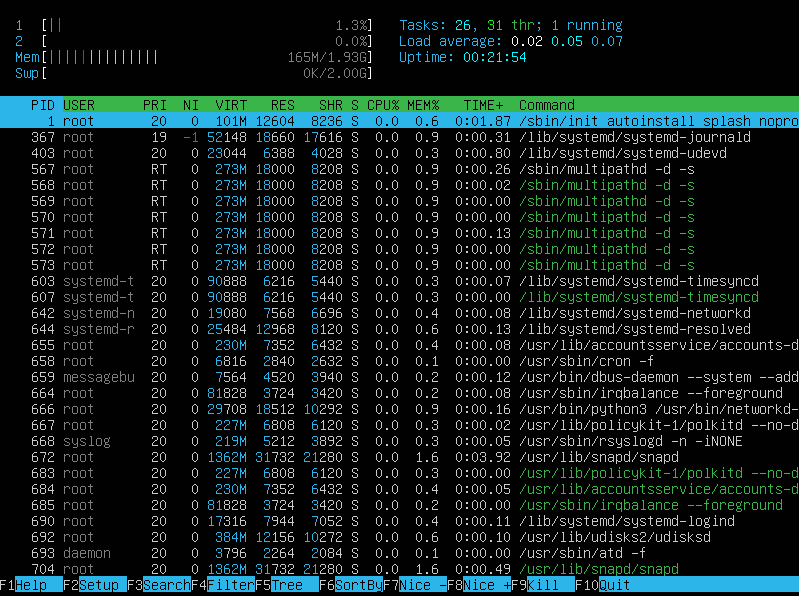  
 2. сортированный по percent_cpu  
 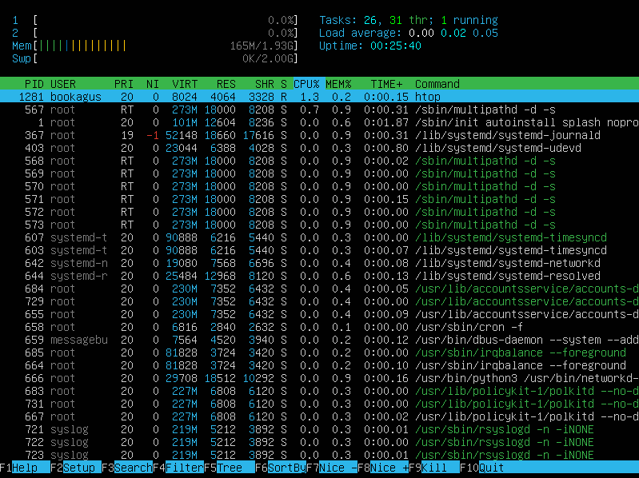  
 3. сортированный по percent_mem  
 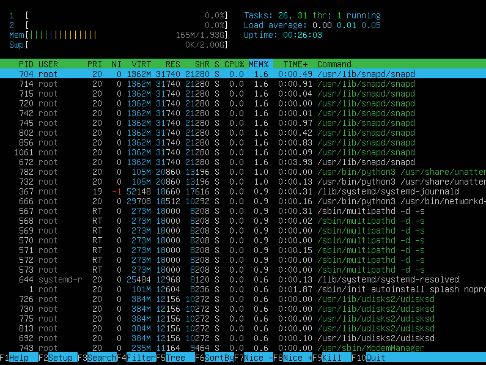  
 4. сортированный по time  
 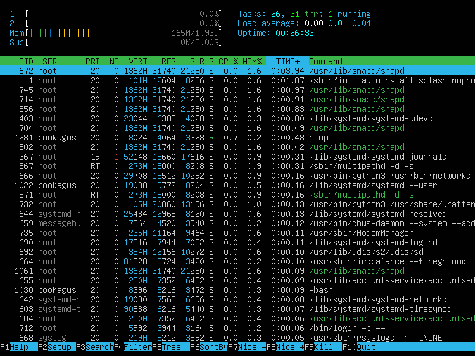   
 5. отфильтрованный по процессу sshd  
 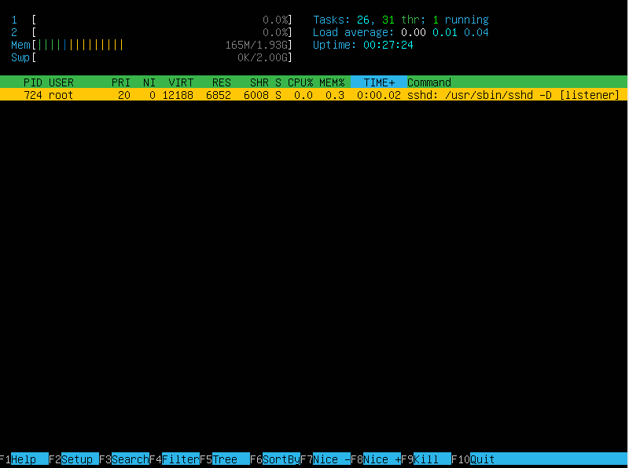  
 6. с процессом syslog, найденным, используя поиск (процесс messagebu)  
 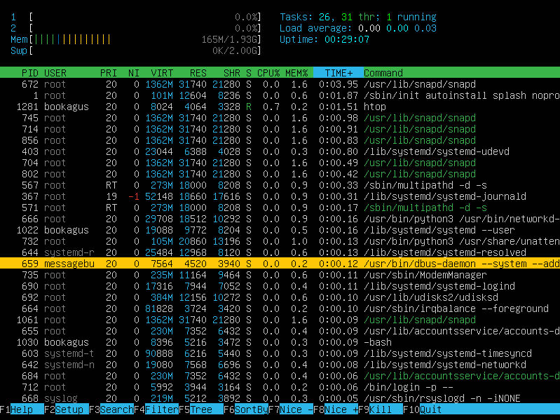  
 7. с добавленным выводом hostname, clock и uptime  
 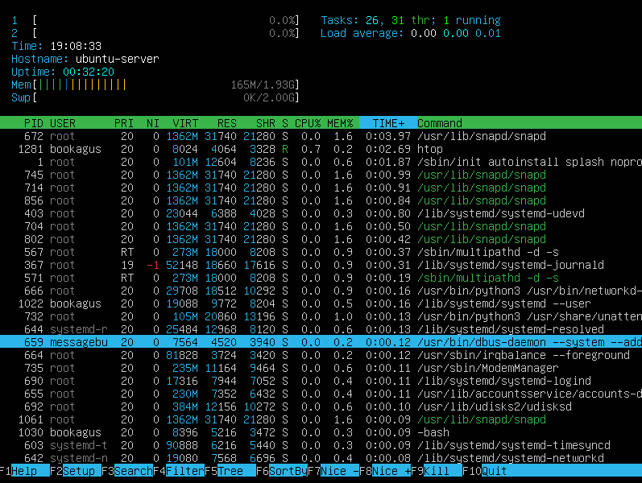  
 
 на этом все!  

## Part 10  

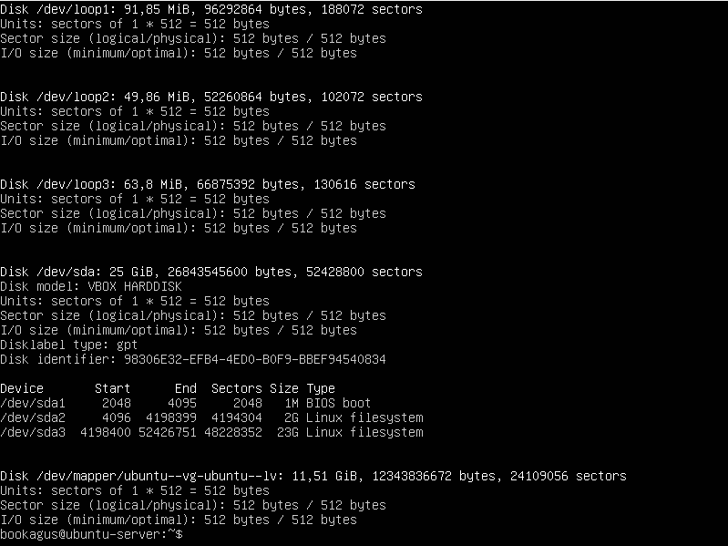  
итак, наш виртуальный жесткий диск называется `/dev/sda`, он состоит из трех секторов `/dev/sda1-3`. на первом секторе лежит наш бутлоадер grub2, который мы видим после запуска BIOS при включении компьютера. второй сектор зарезервирован под SWAP память. она нужна на случай переполнения нашей оперативки.в третьем секторе лежит вся остальная операционная система со всем-всем-всем :)
  
## Part 11  

 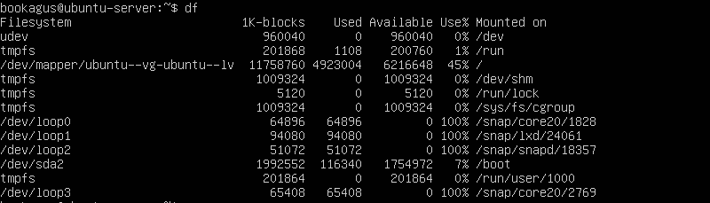 
- у нашего корневого раздела `/`:  
1. размер - **11758760** 1k блоков  
2.  размер занятого пространства - **4923004** 1k блоков
3. размер свободного про-ва - **6216648** 1k блоков
4. процент использования про-ва - **45%**
> 1k блок = 1kB. никак не связано с размером кластера вашего диска  

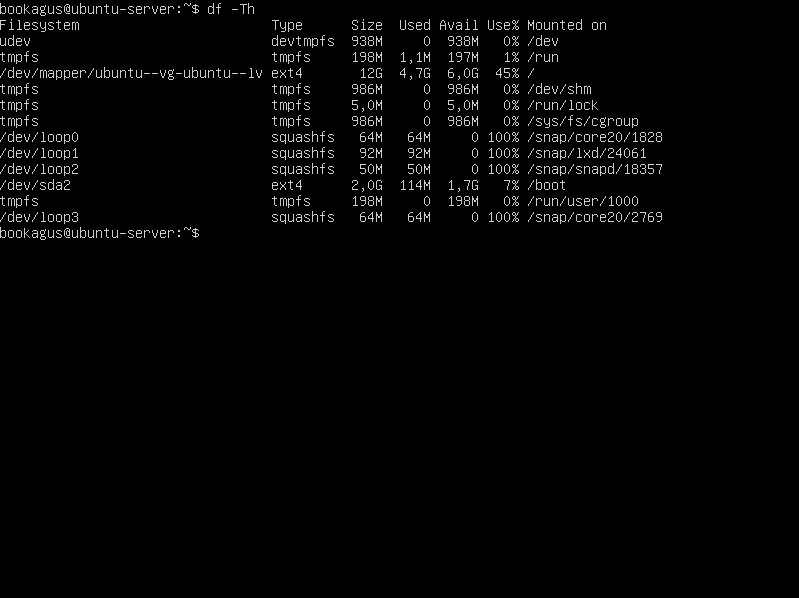     
используя ключи `-T` (показывает типы разделов диска) и `-h` (меняет 1к блоки на человекочитаемый вариант с 
мегабайтами и т.д)  
- в этом случае наш корневой раздел имеет:  
1. тип файловой системы **ext4**
2. **12 Гбайт** всего 
3. **4.7 Гбайт** занято
4. **6.0 Гбайт** свободно
5. и как итог **45%** занятости диска   
 
## Part 12  

- добавляю к команде `du` ключ `-sh` , чтобы на выводе все было в байтах  
1. /home `du -sh /home`  
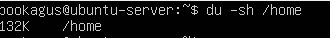  
2. /var `sudo du -sh /var`  
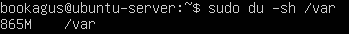  
3. /var/log `sudo du -sh /var/log`  
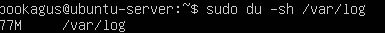
4. /var/log/все файлы `sudo du -sh /var/log/*`  
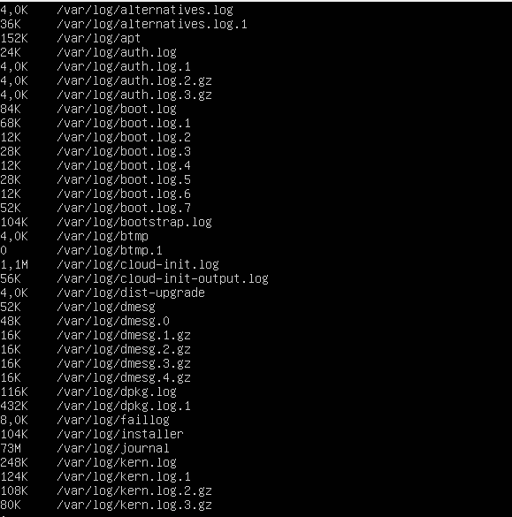  

## Part 13  

- устанавливаем ncdu с помощью команды `sudo apt install ncdu`
- вывожу размер папок:  
1. /home `ncdu /home`  
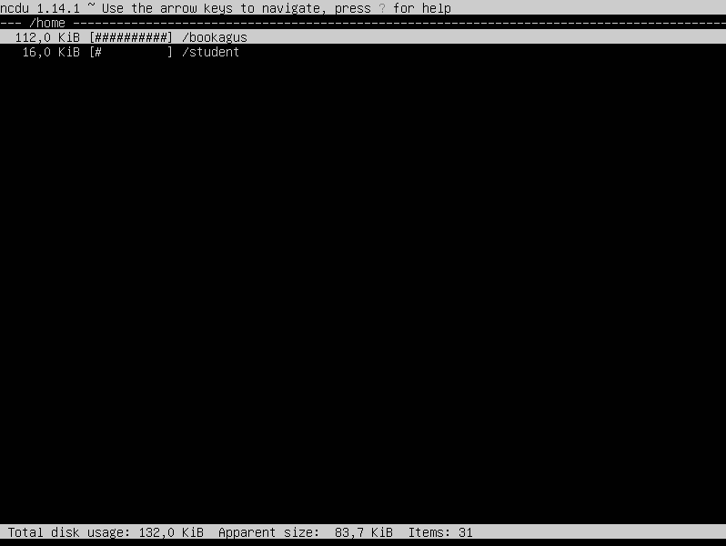  
2. /var `sudo ncdu /var`  
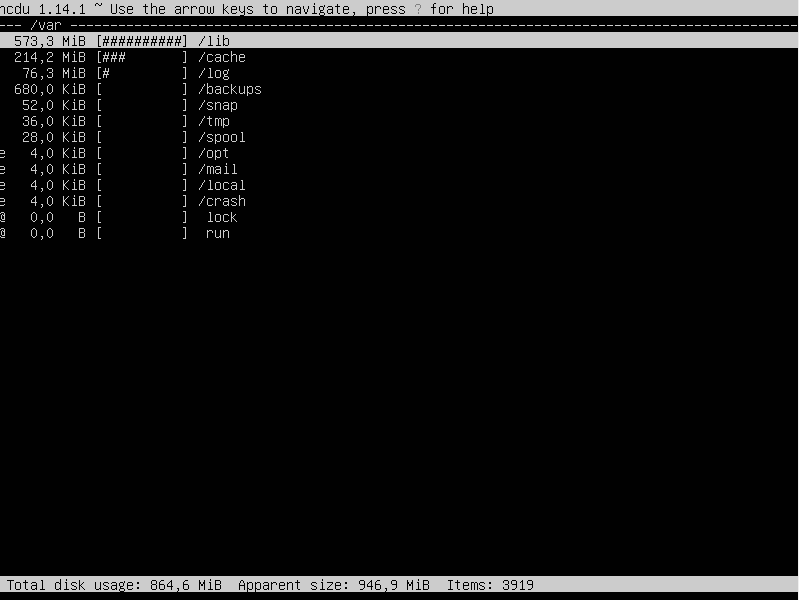  
3. /var/log `sudo ncdu /var/log`  
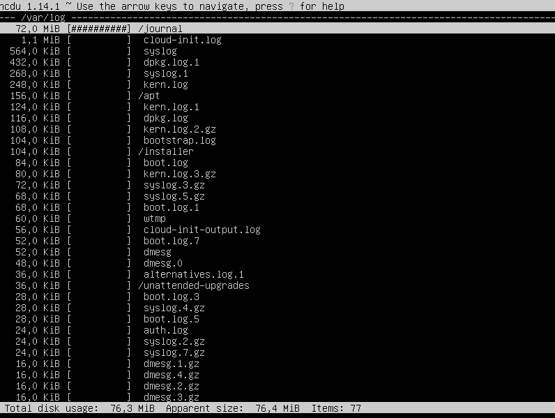  
> размеры директорий примерно совпадают с размерами директорий, полученных, используя команду `du`  в задании 12  

## Part 14

- время последней успешной авторизации ищем в логах `auth.log` , пробрасываем результат чтения через grep с ключевым словом login. получается `sudo cat /var/log/auth.log | grep login` и получаем на выходе время последней успешной авторизации  
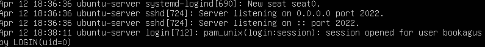   
время: **18:38:11**, имя пользователя: **bookagus**, метод входа: **systemd-logind**

- перезапускаем службу sshd командой `sudo systemctl restart ssh` и ищем ee в логах `sudo cat /var/log/auth.log | grep ssh`. успешно находим сообщение о перезапуске ssh в **21:28:33**  
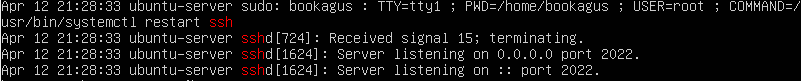   

## Part 15  

- открываем конфиг cron командой `crontab -e`, записываем туда задачку `*/2 * * * * uptime`(каждые две минуты выполняй uptime), сохраняем и выходим.
- смотрим список текущих заданий с помощью команды `crontab -l`  
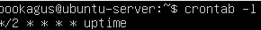  
- спустя какое-то время ищем в логах упоминание об успешно выполненной работе и находим  
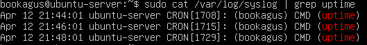  
- успех!
- удаляем все задания из планировщика командой `crontab -r` 
- проверяем `crontab -l`  

## FIN
- это было мощно, спасибо за внимание :)  

