# DO1_Linux

## Part 1
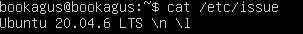  

- *screenshot with currently installed Ubuntu server version*

## Part 2  

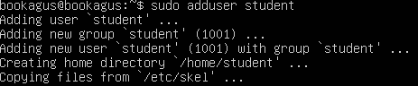  

- *adding user with `useradd` command*  

 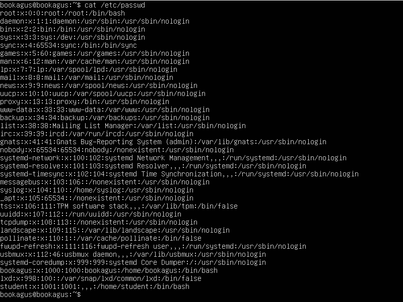  

- *new user (student) in output of `cat /etc/passwd` 
(the last one)*

## Part 3

- to set the machine name as user-1 we'll go to `/etc/hostname` and rewrite it using `sudo` and our text editor **vim** 
- to set the time zone we will create a symlink from `/usr/share/zoneinfo/` to
`/etc/localtime/` using this command `sudo ln -sf /usr/share/zoneinfo/Asia/Yekaterinburg /etc/localtime/`
checking with `timedatectl`  
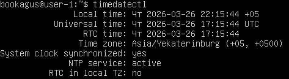
- outputing names of the network interfaces using `ip link` command, which shows 2 interfaces  
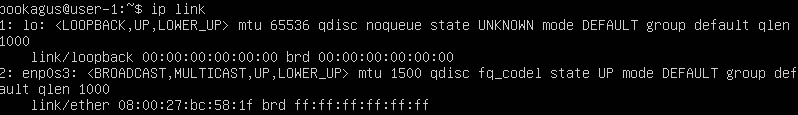
1. lo
 > **lo** (loopback) network interface is used by device to send data to itself for testing and local communication  
2. actual  router interface connected through Ethernet cable *(enp03s)*, which has *ipv6* address
- getting ip address from DHCP server using `sudo dhclient -v` with `-v`(verbose) flag to get more information. DHCP (Dynamic Host Configuration Protocol) is a network manager protocol which automatically assigns ip addresses to devices on a network. It's also responsible for masking our ip address  

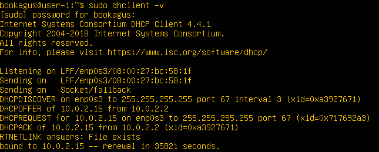

- we can use `ip a` in a console to see all the ip addresses on all network interfaces and redirect its input into **grep** comand fot it to show all the internal ip adresses.  

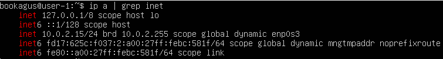  

- to get external ip address of the gateway, which is the address of my router i'm curling the ifconfig with `curl ifconfig.me` command. also I'm adding an empty line to separate it from my hostname and username)  

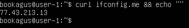  

- setting static ip address and dns settings through changing the config in `/etc/netplan/"my network config.yaml"`.  

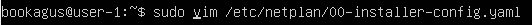  

 - using vim i'm setting my static gateway ip to `192.168.1.175/24`(/24 for masking first 3 numbers and leaving the last one for everyone else to see) and dns servers to `1.1.1.1` and `8.8.8.8`  
 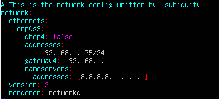  
 next, using `ip route show` command we can assure that we have changed our ip address to this in config file  
   
 - pinging 1.1.1.1 and ya.ru to see if we are connected to network and do we have any packet loss (spoiler: we don't)  
 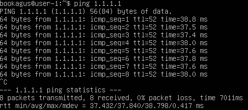  
 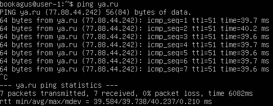  

## Part 4  
- Прописав в терминале комманды `sudo apt update` и `sudo apt upgrade` мы можем обновить системные пакеты до последней версии
- Прилагаю скриншот терминала, который говорит нам о том, что система обновлена и дальше обновлять нечего  

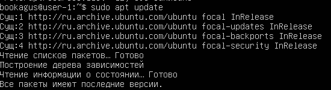

## Part 5

- Назначение команды `sudo` заключается в том, чтобы юзер мог выполнять определенные команды от лица суперюзера (или рута) или от лица любого друга юзера, если это необходимо. Устанавливать пакеты, добавлять/менять/удалять файлы в системных директориях, сидя не на рут аккаунте, можно в том числе c помощью sudo  

- Меняем название самой машины, открывая конфигурацию с правами суперюзера `vim /etc/hostname`на `ubuntu server`  

## Part 6

- Вывод системной службы `timedatectl` и настроек этой службы `timedatectl show` показывают правильное время/часовой пояс и синхронизируют его через интернет `Ntpsynchronized=yes`  

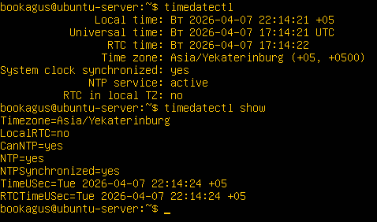

 

